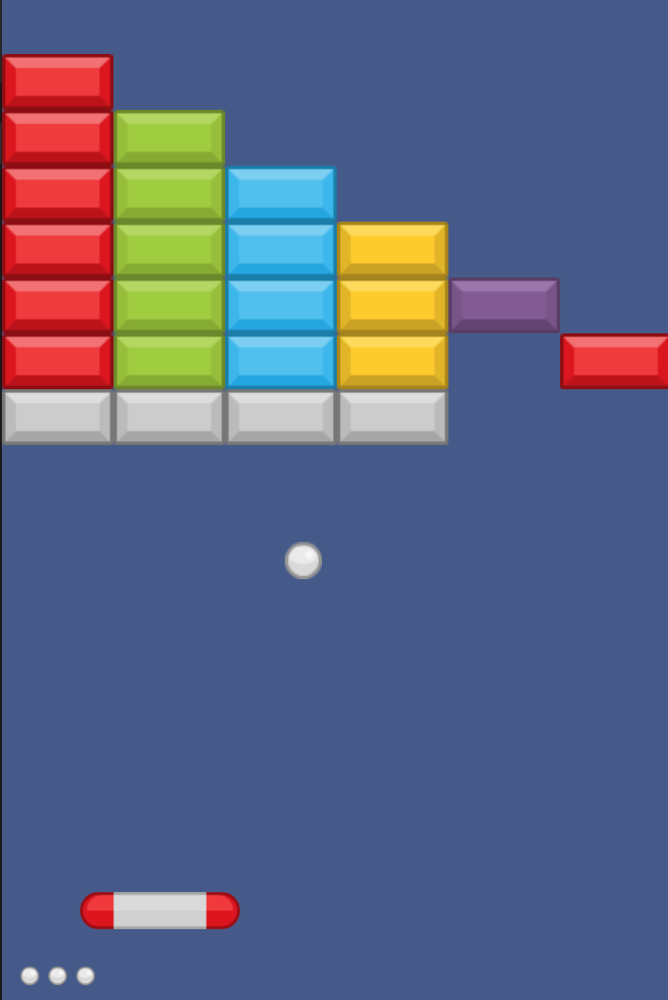

# Arkanoid

## Wat gaan we maken?

Je kent het spel wel: een bal die rondstuitert en blokjes wegtikt. En jij bestuurt een plankje onderin die de bal moet opvangen. Dat gaan we maken!

Het uiteindelijke spel ziet er zo uit:



## Wat leer je in deze les?

* Dingen op het scherm tekenen met "Sprites", zoals een bal en blokken
* Hoe je een bal laat rondvliegen en stuiteren tegen de rand van het scherm
* Hoe je met de muis jouw paddle kunt besturen
* Wat een gameloop is en waarom je die nodig hebt
* De achtergrond van het scherm een kleur geven
* Hoe je blokken kunt raken met een bal
* En vast veel meer!

Laten we beginnen!

## Stap 1: Een bal op het scherm zetten

Bijna elk ding wat je op het scherm wilt zetten is een `Sprite`. Een `Sprite` kun je verplaatsen, laten ronddraaien, groter of kleiner maken en noem maar op. Je geeft je `Sprite` meestal een plaatje. Kijk zo:
```javascript
var ball = Sprite('images/ball.png')
```
Daarmee tekenen we dus ons eerste ding op het scherm en we geven het de naam `ball`. Wat voor ding is het? Een `Sprite` met een plaatje `'images/ball.png'`.
> Bij programmeren spreek je niet over *dingen* maar over *variabelen*. Dus `ball` is een *variabele*, van het type `Sprite`.
Daarna zeggen we hoe groot de bal is. Dat doe je met `size`:
```javascript
ball.size = 20
```
In de volgende stap gaan we de bal ergens op het scherm zetten.

### Zo ziet je code er nu uit
```javascript
var ball = Sprite('images/ball.png')
ball.size = 20
```


## Stap 2: x en y

Alles op je scherm heeft een plek. Die geef je aan met `x` en `y`.

> `x` is horizontaal, dus ergens tussen links en rechts.
`y` is verticaal, dus ergens tussen boven en beneden.

De bal neerzetten doen we zo:

```
ball.x = 20
ball.y = 350
```

Als je de getallen verandert staat het schip telkens op een andere plek.
Probeer maar eens!

> Je kunt `x` en `y` ook in één keer veranderen met `ball.goto(x,y)`. Je zou dus ook `ball.goto(20, 350)` kunnen schrijven.

### Zo ziet je code er nu uit
```javascript
var ball = Sprite('images/ball.png')
ball.size = 20
ball.x = 20
ball.y = 350
```

## Stap 3: De bal bewegen.

Je hebt geleerd dat je een `Sprite` op een plek kunt zetten door zijn `x` en `y` te veranderen. Als je bij de `x` telkens `1` zou optellen dan verschuift de bal naar rechts. Doe je dat bij de `y` dan gaat de bal omlaag. Trek je telkens `1` af van de `y` dan gaat de bal omhoog.

Zullen we dat gaan doen? Voeg dit toe:
```javascript
on.gameloop(function moveBall() {
  ball.move(1, -1)
})
```
Dat ziet er wat moeilijk uit, toch? Wat gebeurt hier nou eigenlijk?

Als je maar één keer je bal zou verplaatsen dan zie je hem niet echt op je beeld bewegen. Je wilt dat de bal *de hele tijd* beweegt. Daarvoor heb je de `gameloop` nodig. De `gameloop` wordt de hele tijd in je spel opnieuw uitgevoerd!

> Een `gameloop` is de gebeurtenis waar alles van je spel gebeurt. De `gameloop` wordt de hele tijd opnieuw uitgevoerd zolang je spel gespeeld wordt.

Een lege `gameloop` schrijf je zo:

```javascript
on.gameloop(function spel() {
  // doe hier wat je wilt
})
```

Met `on.` kun je luisteren naar iets dat gebeurt. Een klik van de muis, een druk op een toets, of in dit geval het opnieuw uitvoeren van een `gameloop`. Met `function() {` start je een nieuw stuk code en sluit je af met `}`. Omdat we beginnen met`on.gameloop(` is het laatste `)` haakje ook nodig.

### Zo ziet je code er nu uit
```javascript
ball = Sprite('images/ball.png')
ball.size = 20
ball.x = 20
ball.y = 350

on.gameloop(function moveBall() {
  ball.move(1, -1)
})
```

## Stap 4: Het scherm

Je kunt het scherm aanpassen met het `Screen` object. So kun je die een achtergrondplaatje geven door de volgende regel code toe te voegen, aan het begin van het spel:
```javascript
Screen.image = 'images/space.png'
```
Nu gaan we in de  `gameloop` programmeren dat je het ruimteschip niet buiten de randen van het scherm kunt bewegen. Dat doe je zo:

```javascript
on.gameloop(function() {
  ship.x = Mouse.x

  if (ship.left < 0) {
    ship.left = 0
  }
  if (ship.right > Screen.right) {
    ship.right = Screen.right
  }
})
```
De linkerkant van het scherm heeft `x` waarde 0. We willen niet dat de linkerkant van ons schip (`ship.left`) verder kan dan 0. Daarom zeggen we:

"als `ship.left` kleiner is dan 0, maak dan `ship.left` 0"

Dat is deze regels code:

```javascript
if (ship.left < 0) {
  ship.left = 0
}
```
De andere regel doet hetzelfde, maar dan voor de rechterkant van het scherm. `Screen.right` heeft altijd de waarde van die rechterkant, dus zeggen we:

"als `ship.right` groter is dan de rechterkant van het scherm, maak dan `ship.rught` gelijk aan `Screen.right`"

### Zo ziet je code er nu uit
```javascript
Screen.image = 'images/space.png'

ship = Sprite('images/ship.png')
ship.goto(250, 450)
ship.size = 50

on.gameloop(function() {
  ship.x = Mouse.x

  if (ship.left < 0) {
    ship.left = 0
  }
  if (ship.right > Screen.right) {
    ship.right = Screen.right
  }
})
```

## Stap 5: Lasers

Eindelijk, we gaan schieten! Met lasers. En niet één laser, maar een heleboel. Daar hebben we een `SpriteList` voor nodig. Dat is een lijst waar je `Sprites` aan kunt toevoegen of verwijderen.

```javascript
lasers = SpriteList()
```

En bij elke klik van de muis gaan we een laser toevoegen aan onze `lasers`:

```javascript
on.click(function(){
  laser = Sprite('images/laser.png')
  laser.size = 30
  laser.goto(ship)
  lasers.add(laser)
})
```

Zoals je ziet gebruiken we weer een `on.` event, in dit geval de klik. Binnen de haakjes van `function(){` en `}` schrijven we onze code die moet gebeuren bij een muisklik.

We maken een nieuwe laser:

`laser = Sprite('images/laser.png')`

Zetten die op de plek van ons ruimteschip met `laser.goto(ship)`, en voegen hem toe aan onze `lasers`:

`lasers.add(laser)`

Het enige dat we nog moeten toevoegen aan de `gameloop` is dat lasers naar boven bewegen en buiten het scherm weer verdwijnen:

```javascript
lasers.each(function(laser){
  laser.y -= 5
  if (laser.bottom < Screen.top) laser.remove()
})
```

Een `SpriteList` zoals onze `lasers` heeft een handige `.each` functie. Daarmee schrijf je wat er met élke `Sprite` in die lijst moet gebeuren. Dus je zegt `lasers.each(function(laser){ ... }`, en op de plek van `...` kun je met `laser` zeggen wat er met elke `laser` moet gebeuren.

In ons geval verplaatsen we de `laser` omhoog:

`laser.y -= 5`

> Dat kun je ook anders schrijven, zoals `laser.y = laser.y - 5` of `laser.move('y', -5)`. Dat doet allemaal hetzelfde: het verandert de `y` van de laser met -5. De min betekent dat hij omhoog gaat.

Uiteindelijk controleren we of de *onderkant* van de laser (`laser.bottom`) hoger is dan de *bovenkant* van het scherm. Als dat zo is, verwijder dan de `laser` met `laser.remove()`:

```javascript
if (laser.bottom < Screen.top) laser.remove()
```

### Zo ziet je code er nu uit
```javascript
Screen.image = 'images/space.png'

ship = Sprite('images/ship.png')
ship.goto(250, 450)
ship.size = 50

lasers = SpriteList()

on.click(function(){
  laser = Sprite('images/laser.png')
  laser.size = 30
  laser.goto(ship)
  lasers.add(laser)
})

on.gameloop(function() {
  ship.x = Mouse.x

  if (ship.left < 0) ship.left = 0
  if (ship.right > Screen.right) ship.right = Screen.right

  lasers.each(function(laser){
    laser.y -= 5
    if (laser.bottom < Screen.top) laser.remove()
  })
})
```

## Stap 6: De achtergrond laten bewegen

We gaan nu iets doen wat ontzettend ingewikkeld is en je niet hoeft te snappen. Maar tik het gewoon over want het ziet er echt cool uit.

Zet onder deze regel:

`Screen.image = 'images/space.png'`

deze:

`Screen.pos = 1`

Vervolgens zet je helemaal onderaan *in* de `gameloop` deze regel:

```javascript
Screen.style.backgroundPosition = 'center ' + Screen.pos++ + 'px'
```

Probeer maar. En denk er verder niet over na wat er in die regel gebeurt :)

### Zo ziet je code er nu uit
```javascript
Screen.image = 'images/space.png'
Screen.pos = 1

ship = Sprite('images/ship.png')
ship.goto(250, 450)
ship.size = 50

lasers = SpriteList()

on.click(function() {
  laser = Sprite('images/laser.png')
  laser.size = 30
  laser.goto(ship)
  lasers.add(laser)
})

on.gameloop(function() {
  ship.x = Mouse.x

  if (ship.left < 0) ship.left = 0
  if (ship.right > Screen.right) ship.right = Screen.right

  lasers.each(function(laser){
    laser.y -= 5
    if (laser.bottom < Screen.top) laser.remove()
  })

  Screen.style.backgroundPosition = 'center ' + Screen.pos++ + 'px' // bonus
})
```

## Stap 7: Vijanden

Net als voor onze `lasers` gaan we ook een `SpriteList` gebruiken om meerdere vijanden (`enemies`) te maken.

```javascript
enemies = SpriteList()
```
Nu voegen we er 10 toe. Daarvoor schrijf je in javascript een *for loop*. Die ziet er zo uit:
```javascript
for (var nr=0; nr<10; nr++) {
  ...
}
```
> Dat lees je zo: maak een *variabele* genaamd `nr` en zet hem op `0`. Zolang `nr` kleiner is dan `10`, doe dan `nr++` (oftewel, tel `1` op bij `nr`).

Binnen de *for* loop schrijf je wat je wilt doen met `nr`. Dit is wat we gaan doen:

```javascript
for (var nr=0; nr<10; nr++) {
  enemy = Sprite('images/enemy.png')
  enemy.size = 40;
  enemy.x = between(0, Screen.right)
  enemy.y = Screen.top - between(200, 500) * nr
  enemies.add(enemy)
}
```
We maken een `Sprite`, geven hem een `size`. De `x` zetten we willekeurig tussen de linkerkant en rechterkant van het scherm met de `between` functie.

> Met de functie `between(3, 7)` krijg je een willekeurig getal terug tussen 3 en 7.

De `y` zetten ergens boven het scherm. De plek is telkens `nr` keer een getal tussen de 200 en 500.

Nu moeten onze 10 enemies alleen nog omlaag vliegen. Dat doen we in de `gameloop`:

```javascript
enemies.each(function(enemy){
  enemy.y += 5
})
```

### Zo ziet je code er nu uit
```javascript
Screen.image = 'images/space.png'
Screen.pos = 1

ship = Sprite('images/ship.png')
ship.goto(250, 450)
ship.size = 50

lasers = SpriteList()
enemies = SpriteList()

for (var nr=0; nr<10; nr++) {
  enemy = Sprite('images/enemy.png')
  enemy.size = 40;
  enemy.x = between(0, Screen.right)
  enemy.y = Screen.top - between(200, 500) * nr
  enemies.add(enemy)
}

on.click(function() {
  laser = Sprite('images/laser.png')
  laser.size = 30
  laser.goto(ship)
  lasers.add(laser)
})

on.gameloop(function() {
  ship.x = Mouse.x

  if (ship.left < 0) ship.left = 0
  if (ship.right > Screen.right) ship.right = Screen.right

  enemies.each(function(enemy){
    enemy.y += 5
  })

  lasers.each(function(laser){
    laser.y -= 5
    if (laser.bottom < Screen.top) laser.remove()
  })

  Screen.style.backgroundPosition = 'center ' + Screen.pos++ + 'px' // bonus
})
```

## Stap 8: Vijanden mooier laten bewegen

In de `gameloop` bewogen we telkens elke `enemy` met `5` omlaag:

`enemy.y += 5`

We gaan nu elke `enemy` een eigen snelheid omlaag geven, en een heel klein beetje opzij. Dat doen we op de plek waar we alle vijanden maken:

```javascript
for (var nr=0; nr<10; nr++) {
  enemy = Sprite('images/enemy.png')
  ...
}
```
Voeg daar dit aan toe:
```javascript
  enemy.speedY = between(2, 5)
  enemy.speedX = between(-5, 5) / 10
```
De `speedY` is de snelheid omlaag. Die is tussen de `2` en `5`. De snelheid links of rechts moet heel klein zijn, tussen de min half en plus half. Dus doen we `between(-5, 5)` en dat delen we door `10`.

Nu gaan we in de `gameloop` het stukje met de `enemies` aanpassen. Verander dit:

```javascript
  enemies.each(function(enemy){
    ...
  })
```
In dit:
```javascript
  enemies.each(function(enemy){
    enemy.y += enemy.speedY
    enemy.x += enemy.speedX
    if (enemy.top > Screen.bottom) {
      enemy.x = between(0, Screen.right)
      enemy.y = Screen.top - between(200, 500)
    }
  })
```
We verplaatsen elke `enemy` nu met zijn eigen `.speedX` en `.speedY`. Daarnaast kijken we of de `enemy` het scherm verlaat aan de onderkant. Als dat zo is, zetten we hem opnieuw bovenin het scherm!

### Zo ziet je code er nu uit
```javascript
Screen.image = 'images/space.png'
Screen.pos = 1

ship = Sprite('images/ship.png')
ship.goto(250, 450)
ship.size = 50

lasers = SpriteList()
enemies = SpriteList()

for (var nr=0; nr<10; nr++) {
  enemy = Sprite('images/enemy.png')
  enemy.size = 40;
  enemy.x = between(0, Screen.right)
  enemy.y = Screen.top - between(200, 500) * nr
  enemy.speedY = between(2, 5)
  enemy.speedX = between(-5, 5) / 10
  enemies.add(enemy)
}

on.click(function(){
  laser = Sprite('images/laser.png')
  laser.size = 30
  laser.goto(ship)
  lasers.add(laser)
})

on.gameloop(function() {
  ship.x = Mouse.x

  if (ship.left < 0) ship.left = 0
  if (ship.right > Screen.right) ship.right = Screen.right

  enemies.each(function(enemy){
    enemy.y += enemy.speedY
    enemy.x += enemy.speedX
    if (enemy.top > Screen.bottom) {
      enemy.x = between(0, Screen.right)
      enemy.y = Screen.top - between(200, 500)
    }
  })

  lasers.each(function(laser){
    laser.y -= 5
    if (laser.bottom < Screen.top) laser.remove()
  })

  Screen.style.backgroundPosition = 'center ' + Screen.pos++ + 'px' // bonus
})
```

## Stap 9: Een vijand kunnen neerschieten

In de `gameloop` doen we dit:

```javascript
  lasers.each(function(laser){
    ...
  });
```
Daar voegen we het volgende aan toe:
```javascript
    enemy = laser.touches(enemies)
    if (enemy) {
      laser.remove()
      enemy.x = between(0, Screen.right)
      enemy.y = Screen.top - between(200, 500)
    }
```
We gebruiken `laser.touches(enemies)` om te zien of onze `laser` één van de `enemies` aanraakt. Als dat zo is dan wordt deze toegewezen aan onze *variabele* `enemy`:

```javascript
enemy = laser.touches(enemies)
```
Als die bestaat, dan hebben we een vijand geraakt! Dus dan halen we de `laser` van het scherm met `laser.remove()` en zetten we de `enemy` weer ergens boven in het scherm, alsof er straks weer een nieuwe vijand komt.

Uiteindelijk mag je zelf niet geraakt worden door een vijand. Dat doen we door in de `gameloop` dit te schrijven:

```javascript
  if (ship.touches(enemies)) {
    ship.remove()
    Ready.stop()
  }
```
Als ons schip één van de enemies raakt, haal dan ons schip weg en stop het spel.

Dat was het. Veel plezier!

### Zo ziet je code er nu uit
```javascript
Screen.image = 'images/space.png'
Screen.pos = 1

ship = Sprite('images/ship.png')
ship.goto(250, 450)
ship.size = 50

lasers = SpriteList()
enemies = SpriteList()

for (var nr=0; nr<10; nr++) {
  enemy = Sprite('images/enemy.png')
  enemy.size = 40;
  enemy.x = between(0, Screen.right)
  enemy.y = Screen.top - between(200, 500) * nr
  enemy.speedY = between(2, 5)
  enemy.speedX = between(-5, 5) / 10
  enemies.add(enemy)
}

on.click(function(){
  laser = Sprite('images/laser.png')
  laser.size = 30
  laser.goto(ship)
  lasers.add(laser)
})

on.gameloop(function() {
  ship.x = Mouse.x

  if (ship.left < 0) ship.left = 0
  if (ship.right > Screen.right) ship.right = Screen.right

  enemies.each(function(enemy){
    enemy.y += enemy.speedY
    enemy.x += enemy.speedX
    if (enemy.top > Screen.bottom) {
      enemy.x = between(0, Screen.right)
      enemy.y = Screen.top - between(200, 500)
    }
  })

  lasers.each(function(laser){
    laser.y -= 5
    if (laser.bottom < Screen.top) laser.remove()

    enemy = laser.touches(enemies)
    if (enemy) {
      laser.remove()
      enemy.x = between(0, Screen.right)
      enemy.y = Screen.top - between(200, 500)
    }
  })

  if (ship.touches(enemies)) {
    ship.remove()
    Ready.stop()
  }


  Screen.style.backgroundPosition = 'center ' + Screen.pos++ + 'px' // bonus
})
```