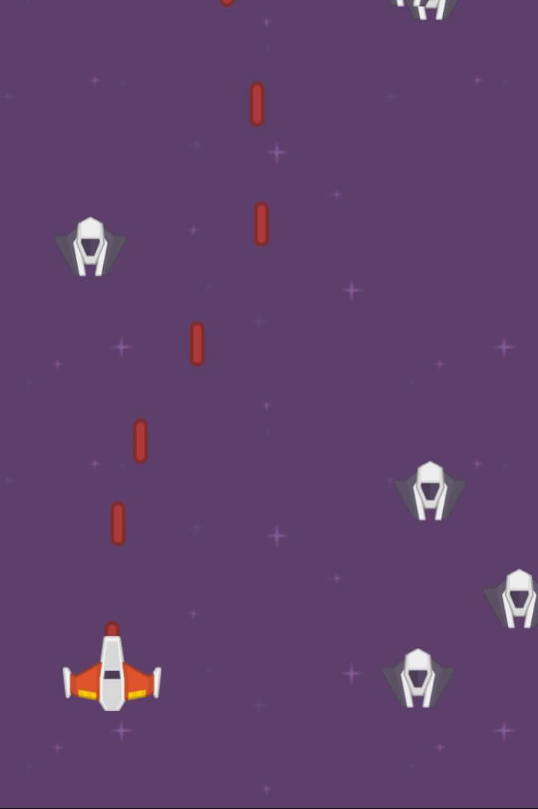

# Space Shooter

## Wat gaan we maken?

In deze les gaan we een spel maken in de ruimte. Je bestuurt een ruimteschip dat vijanden kapot moet schieten die op je af komen.

Het uiteindelijke spel ziet er zo uit:



## Wat leer je in deze les?

* Dingen op het scherm tekenen met "Sprites", zoals ruimteschepen en lasers
* Hoe je met de muis jouw eigen ruimteschip kunt besturen
* Wat een gameloop is en waarom je die nodig hebt
* De achtergrond een plaatje geven
* Hoe je meerdere vijanden kunt laten bewegen
* Dat je lasers kunt afschieten
* Hoe je programmeert dat je een vijand kunt raken met jouw lasers

Laten we beginnen!

## Beginnen

Begin met een nieuw bestand in Kladblok (Windows) of TextEdit (Mac) waarin je ReadyJS en de afbeeldingen inlaadt. Dat doe je met deze regels code:

`<script src="https://q42.github.io/almostreadyjs/ready.js"/></script><script>`

`Game.path = 'https://storage.googleapis.com/readyjs-filesimages/_demos'`

`// Jouw code gaat hier!`

`</script>`

## Stap 1: een "ding" maken

Als eerst gaan we ons ruimteschip tekenen. Daarvoor gebruiken we een `Sprite`. Een `Sprite` kan vanalles zijn, denk aan een auto die rijdt, een ridder die rondspringt of een ruimteschip, een vijand of een laser.

Om ons ruimteschip te maken, tik het volgende over in de editor links:

```javascript
ship = Sprite('images/ship.png')
```

Daarmee tekenen we ons eerste ding op het scherm en we geven het de naam `ship`. Wat voor ding is het? Een `Sprite` met een plaatje `'images/ship.png'`.

> Bij programmeren spreek je niet over *dingen* maar over *variabelen*. Dus `ship` is een *variabele*, van het type `Sprite`.

Als je de code nu *start* met de knop boven de code, staat ons schip half buiten beeld. In de volgende stap gaan we dat veranderen.

### Zo ziet je code er nu uit
```javascript
ship = Sprite('images/ship.png')
```

## Stap 2: x en y

Alles op je scherm heeft een plek. Die geef je aan met `x` en `y`.

> `x` is horizontaal, dus ergens tussen links en rechts.
`y` is verticaal, dus ergens tussen boven en beneden.

Ons schip neerzetten doen we als volgt. Schrijf het volgende onder de regel code die je nu hebt:

```javascript
ship.x = 250
ship.y = 450
```
Gedaan? Dan staat het ruimteschip nu op een andere plek.

> Als je de getallen verandert staat het schip telkens op een andere plek. Probeer maar eens!

Je kunt `x` en `y` ook in één keer veranderen met `ship.goto`. Verander de twee regels code die je net hebt toegevoegd in de volgende:

```javascript
ship.goto(250, 450)
```
Dus je eerst de x, daarna de y. Nu gaan we nog aangeven aan hoe groot ons `ship` is. Voeg dit nog toe:
```javascript
ship.size = 50
```
Zoals je ziet zet je met `ship.size` de grootte van je `Sprite`.

### Zo ziet je code er nu uit
```javascript
ship = Sprite('images/ship.png')
ship.goto(250, 450)
ship.size = 50
```

## Stap 3: Ons ruimteschip bewegen

We hebben nu een ruimteschip op het scherm staan. Nu gaan we die besturen met de muis. Daarvoor bestaat er al een `Mouse` object. Net als een `Sprite` heeft `Mouse` ook een `x` en `y`, namelijk `Mouse.x` en `Mouse.y`.
Voeg de volgende code toe:
```javascript
on.gameloop(function(){
  ship.x = Mouse.x
})
```
Dat lijkt wat ingewikkeld. Wat gebeurt hier? Je ziet dat we dit doen:
```javascript
  ship.x = Mouse.x
```
We zetten dus het schip op de `x` plek van de muis. Maar, we willen dat dit de hele tijd gebeurt, en niet maar één keertje!
Daarom hebben we de `gameloop` nodig.

> De `gameloop` is waar alles gebeurt van je spel. De `gameloop` wordt de hele tijd opnieuw uitgevoerd zolang je spel gespeeld wordt.

Zo roep je de `gameloop` aan:
```javascript
on.gameloop(function(){
  // doe hier wat je wilt
})
```
> Met `on.` kun je luisteren naar iets dat gebeurt. Een klik van de muis, een druk op een toets, of in dit geval het opnieuw uitvoeren van een `gameloop`. Met `function(){` start je een nieuw stuk code en sluit je af met `}`. Omdat we beginnen met `on.gameloop(` is het laatste `)` haakje ook nodig.

### Zo ziet je code er nu uit
```javascript
ship = Sprite('images/ship.png')
ship.goto(250, 450)
ship.size = 50

on.gameloop(function(e){
  ship.x = Mouse.x
})
```

## Stap 4: Het scherm

Je kunt het scherm aanpassen met het `Screen` object. Zo kun je die een achtergrondplaatje geven door de volgende regel code toe te voegen. Schrijf dit helemaal bovenin je code als eerste regel:
```javascript
Screen.image = 'images/space.png'
```
Nu gaan we in de  `gameloop` programmeren dat je het ruimteschip niet buiten de randen van het scherm kunt bewegen. Pas de `gameloop` zo aan:
```javascript
on.gameloop(function(e) {
  ship.x = Mouse.x

  if (ship.left < 0) ship.left = 0
  if (ship.right > Screen.right) ship.right = Screen.right
})
```
> De linkerkant van het scherm heeft `x` waarde 0.
We willen niet dat de linkerkant van ons schip (`ship.left`) verder kan dan 0. Daarom zeggen we:

"als `ship.left` kleiner is dan 0, maak dan `ship.left` 0"

Dat is deze regel code:
```javascript
if (ship.left < 0) ship.left = 0
```
De andere regel doet hetzelfde, maar dan voor de rechterkant van het scherm.
> `Screen.right` heeft altijd de waarde van die rechterkant.

Daarom zeggen we:

"als `ship.right` groter is dan de rechterkant van het scherm, maak dan `ship.right` gelijk aan `Screen.right`"

### Zo ziet je code er nu uit
```javascript
Screen.image = 'images/space.png'

ship = Sprite('images/ship.png')
ship.goto(250, 450)
ship.size = 50

on.gameloop(function(e) {
  ship.x = Mouse.x

  if (ship.left < 0) ship.left = 0
  if (ship.right > Screen.right) ship.right = Screen.right
})
```

## Stap 5: Lasers

Eindelijk, we gaan schieten! Met lasers. En niet één laser, maar een heleboel. Daar hebben we een `SpriteList` voor nodig. Dat is een lijst waar je `Sprites` aan kunt toevoegen of verwijderen.
Zet onder de regel `ship.size = 50` het volgende:
```javascript
lasers = SpriteList()
```
Bij elke klik van de muis gaan we een laser toevoegen aan onze `lasers`. Schrijf de volgende code onder de regel die je net schreef:
```javascript
on.click(function(){
  laser = Sprite('images/laser.png')
  laser.size = 30
  laser.goto(ship)
  lasers.add(laser)
})
```
Zoals je ziet gebruiken we weer een `on.` event, in dit geval de `click`. Binnen de haakjes van `function(){` en `}` schrijven we onze code die moet gebeuren bij een muisklik.
We maken een laser en zetten die op de plek van ons ruimteschip met `laser.goto(ship)`.
Dan voegen we hem toe aan onze `lasers`. Dat doet deze regel code die je al geschreven hebt:
```javascript
lasers.add(laser)
```
Het enige dat we nog moeten toevoegen aan de `gameloop` is dat lasers naar boven bewegen en buiten het scherm weer verdwijnen.
Schrijf het volgende *in* je `gameloop`, onderaan, maar dus nog voor de regel met `})`:
```javascript
lasers.each(function(laser){
  laser.y -= 5
  if (laser.bottom < Screen.top) laser.remove()
})
```
Een `SpriteList` zoals onze `lasers` heeft een handige `.each` functie. Daarmee schrijf je wat er met élke `Sprite` in die lijst moet gebeuren. Dus je zegt `lasers.each(function(laser){ ... }`, en op de plek van `...` kun je met `laser` zeggen wat er met elke `laser` moet gebeuren.

In ons geval verplaatsen we de `laser` omhoog:
```javascript
laser.y -= 5
```

> Dat kun je ook anders schrijven, zoals `laser.y = laser.y - 5` of `laser.move('y', -5)`. Dat doet allemaal hetzelfde: het verandert de `y` van de laser met -5. De min betekent dat hij omhoog gaat.

Uiteindelijk controleren we of de *onderkant* van de laser (`laser.bottom`) hoger is dan de *bovenkant* van het scherm. Als dat zo is, verwijder dan de `laser` met `laser.remove()`. Dat hebben we net geschreven met deze regel:
```javascript
if (laser.bottom < Screen.top) laser.remove()
```

### Zo ziet je code er nu uit
```javascript
Screen.image = 'images/space.png'

ship = Sprite('images/ship.png')
ship.goto(250, 450)
ship.size = 50

lasers = SpriteList()

on.click(function(){
  laser = Sprite('images/laser.png')
  laser.size = 30
  laser.goto(ship)
  lasers.add(laser)
})

on.gameloop(function() {
  ship.x = Mouse.x

  if (ship.left < 0) ship.left = 0
  if (ship.right > Screen.right) ship.right = Screen.right

  lasers.each(function(laser){
    laser.y -= 5
    if (laser.bottom < Screen.top) laser.remove()
  })
})
```

## Stap 6: De achtergrond laten bewegen

We gaan nu iets doen wat ontzettend ingewikkeld is en je niet hoeft te snappen. Maar tik het gewoon over want het ziet er echt cool uit.

Helemaal bovenin heb je dit staan als het goed is:
```javascript
Screen.image = 'images/space.png'
```
Schrijf daar deze regel onder:
```javascript
Screen.pos = 1
```
Vervolgens zet je helemaal onderaan *in* de `gameloop` deze regel:
```javascript
Screen.style.backgroundPosition = 'center ' + Screen.pos++ + 'px'
```
Probeer maar. En denk er verder niet over na wat er in die regel gebeurt :)

### Zo ziet je code er nu uit
```javascript
Screen.image = 'images/space.png'
Screen.pos = 1

ship = Sprite('images/ship.png')
ship.goto(250, 450)
ship.size = 50

lasers = SpriteList()

on.click(function(){
  laser = Sprite('images/laser.png')
  laser.size = 30
  laser.goto(ship)
  lasers.add(laser)
})

on.gameloop(function() {
  ship.x = Mouse.x

  if (ship.left < 0) ship.left = 0
  if (ship.right > Screen.right) ship.right = Screen.right

  lasers.each(function(laser){
    laser.y -= 5
    if (laser.bottom < Screen.top) laser.remove()
  })

  Screen.style.backgroundPosition = 'center ' + Screen.pos++ + 'px'
})
```

## Stap 7: Vijanden

Net als voor onze `lasers` gaan we ook een `SpriteList` gebruiken om meerdere vijanden (`enemies`) te maken.
Onder deze regel...
```javascript
lasers = SpriteList()
```
Schrijf daar deze:
```javascript
enemies = SpriteList()
```
Nu gaan we 10 vijanden toevoegen. Daarvoor schrijf je in javascript een *for loop*. Die ziet er zo uit:
```javascript
for (var nr=0; nr<10; nr++) {
  ...
}
```
> Dat lees je zo: maak een *variabele* genaamd `nr` en zet hem op `0`. Zolang `nr` kleiner is dan `10`, doe dan `nr++` (oftewel, tel `1` op bij `nr`).

Binnen de *for* loop schrijf je wat je wilt doen met `nr`. Voeg onder de regel `enemies = SpriteList()` het volgende toe:

```javascript
for (var nr=0; nr<10; nr++) {
  enemy = Sprite('images/enemy.png')
  enemy.size = 40;
  enemy.x = between(0, Screen.right)
  enemy.y = Screen.top - between(200, 500) * nr
  enemies.add(enemy)
}
```
We maken een `Sprite`, geven hem een `size`. De `x` zetten we willekeurig tussen de linkerkant en rechterkant van het scherm met de `between` functie.

> Met de functie `between(3, 7)` krijg je een willekeurig getal terug tussen 3 en 7.

De `y` zetten ergens boven het scherm. De plek is telkens `nr` keer een getal tussen de 200 en 500.

Nu moeten onze 10 enemies alleen nog omlaag vliegen. Plaats het volgende *in* de `gameloop`:

```javascript
enemies.each(function(enemy){
  enemy.y += 5
})
```

### Zo ziet je code er nu uit
```javascript
Screen.image = 'images/space.png'
Screen.pos = 1

ship = Sprite('images/ship.png')
ship.goto(250, 450)
ship.size = 50

lasers = SpriteList()
enemies = SpriteList()

for (var nr=0; nr<10; nr++) {
  enemy = Sprite('images/enemy.png')
  enemy.size = 40;
  enemy.x = between(0, Screen.right)
  enemy.y = Screen.top - between(200, 500) * nr
  enemies.add(enemy)
}

on.click(function(){
  laser = Sprite('images/laser.png')
  laser.size = 30
  laser.goto(ship)
  lasers.add(laser)
})

on.gameloop(function() {
  ship.x = Mouse.x

  if (ship.left < 0) ship.left = 0
  if (ship.right > Screen.right) ship.right = Screen.right

  enemies.each(function(enemy){
    enemy.y += 5
  })

  lasers.each(function(laser){
    laser.y -= 5
    if (laser.bottom < Screen.top) laser.remove()
  })

  Screen.style.backgroundPosition = 'center ' + Screen.pos++ + 'px'
})
```

## Stap 8: Vijanden mooier laten bewegen

In de `gameloop` bewogen we telkens elke `enemy` met `5` omlaag:
```javascript
enemy.y += 5
```
We gaan nu elke `enemy` een eigen snelheid omlaag geven, en een heel klein beetje opzij. Dat doen we op de plek waar we alle vijanden maken:
```javascript
for (var nr=0; nr<10; nr++) {
  enemy = Sprite('images/enemy.png')
  ...
}
```
Voeg daar dit aan toe, *in* de *for* loop:
```javascript
enemy.speedY = between(2, 5)
enemy.speedX = between(-5, 5) / 10
```
> De `speedY` is de snelheid omlaag. Die is tussen de `2` en `5`. De snelheid links of rechts moet heel klein zijn, tussen de min half en plus half. Dus doen we `between(-5, 5)` en dat delen we door `10`.

Nu gaan we in de `gameloop` het stukje met de `enemies` aanpassen. Verander dit:
```javascript
enemies.each(function(enemy){
  ...
})
```
In dit:
```javascript
enemies.each(function(enemy){
  enemy.y += enemy.speedY
  enemy.x += enemy.speedX
  if (enemy.top > Screen.bottom) {
    enemy.x = between(0, Screen.right)
    enemy.y = Screen.top - between(200, 500)
  }
})
```
We verplaatsen elke `enemy` nu met zijn eigen `.speedX` en `.speedY`. Daarnaast kijken we of de `enemy` het scherm verlaat aan de onderkant. Als dat zo is, zetten we hem opnieuw bovenin het scherm!

### Zo ziet je code er nu uit
```javascript
Screen.image = 'images/space.png'
Screen.pos = 1

ship = Sprite('images/ship.png')
ship.goto(250, 450)
ship.size = 50

lasers = SpriteList()
enemies = SpriteList()

for (var nr=0; nr<10; nr++) {
  enemy = Sprite('images/enemy.png')
  enemy.size = 40;
  enemy.x = between(0, Screen.right)
  enemy.y = Screen.top - between(200, 500) * nr
  enemy.speedY = between(2, 5)
  enemy.speedX = between(-5, 5) / 10
  enemies.add(enemy)
}

on.click(function(){
  laser = Sprite('images/laser.png')
  laser.size = 30
  laser.goto(ship)
  lasers.add(laser)
})

on.gameloop(function() {
  ship.x = Mouse.x

  if (ship.left < 0) ship.left = 0
  if (ship.right > Screen.right) ship.right = Screen.right

  enemies.each(function(enemy){
    enemy.y += enemy.speedY
    enemy.x += enemy.speedX
    if (enemy.top > Screen.bottom) {
      enemy.x = between(0, Screen.right)
      enemy.y = Screen.top - between(200, 500)
    }
  })

  lasers.each(function(laser){
    laser.y -= 5
    if (laser.bottom < Screen.top) laser.remove()
  })

  Screen.style.backgroundPosition = 'center ' + Screen.pos++ + 'px'
})
```

## Stap 9: Een vijand kunnen neerschieten

In de `gameloop` doen we dit:
```javascript
lasers.each(function(laser){
  ...
});
```
Voeg daar het volgende aan toe, dus *binnen* de `{` en `}`:
```javascript
enemy = laser.touches(enemies)
if (enemy) {
  laser.remove()
  enemy.x = between(0, Screen.right)
  enemy.y = Screen.top - between(200, 500)
}
```
We gebruiken `laser.touches(enemies)` om te zien of onze `laser` één van de `enemies` aanraakt.
Als dat zo is dan wordt deze toegewezen aan onze *variabele* `enemy`:
```javascript
enemy = laser.touches(enemies)
```
Als die bestaat, dan hebben we een vijand geraakt!
Dus dan halen we de `laser` van het scherm met `laser.remove()` en zetten we de `enemy` weer ergens boven in het scherm, alsof er straks weer een nieuwe vijand komt.

Uiteindelijk mag je zelf niet geraakt worden door een vijand. Dat doen we door onderaan *in* de `gameloop` dit te schrijven:
```javascript
if (ship.touches(enemies)) {
  ship.remove()
  Ready.stop()
}
```
Als ons schip één van de enemies raakt, haal dan ons schip weg en stop het spel.

#Dat was het. Veel plezier!#

### Zo ziet je code er nu uit
```javascript
Screen.image = 'images/space.png'
Screen.pos = 1

ship = Sprite('images/ship.png')
ship.goto(250, 450)
ship.size = 50

lasers = SpriteList()
enemies = SpriteList()

for (var nr=0; nr<10; nr++) {
  enemy = Sprite('images/enemy.png')
  enemy.size = 40;
  enemy.x = between(0, Screen.right)
  enemy.y = Screen.top - between(200, 500) * nr
  enemy.speedY = between(2, 5)
  enemy.speedX = between(-5, 5) / 10
  enemies.add(enemy)
}

on.click(function(){
  laser = Sprite('images/laser.png')
  laser.size = 30
  laser.goto(ship)
  lasers.add(laser)
})

on.gameloop(function() {
  ship.x = Mouse.x

  if (ship.left < 0) ship.left = 0
  if (ship.right > Screen.right) ship.right = Screen.right

  enemies.each(function(enemy){
    enemy.y += enemy.speedY
    enemy.x += enemy.speedX
    if (enemy.top > Screen.bottom) {
      enemy.x = between(0, Screen.right)
      enemy.y = Screen.top - between(200, 500)
    }
  })

  lasers.each(function(laser){
    laser.y -= 5
    if (laser.bottom < Screen.top) laser.remove()

    enemy = laser.touches(enemies)
    if (enemy) {
      laser.remove()
      enemy.x = between(0, Screen.right)
      enemy.y = Screen.top - between(200, 500)
    }
  })

  if (ship.touches(enemies)) {
    ship.remove()
    Ready.stop()
  }


  Screen.style.backgroundPosition = 'center ' + Screen.pos++ + 'px'
})
```
